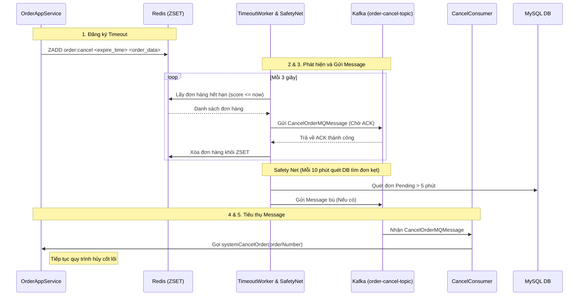
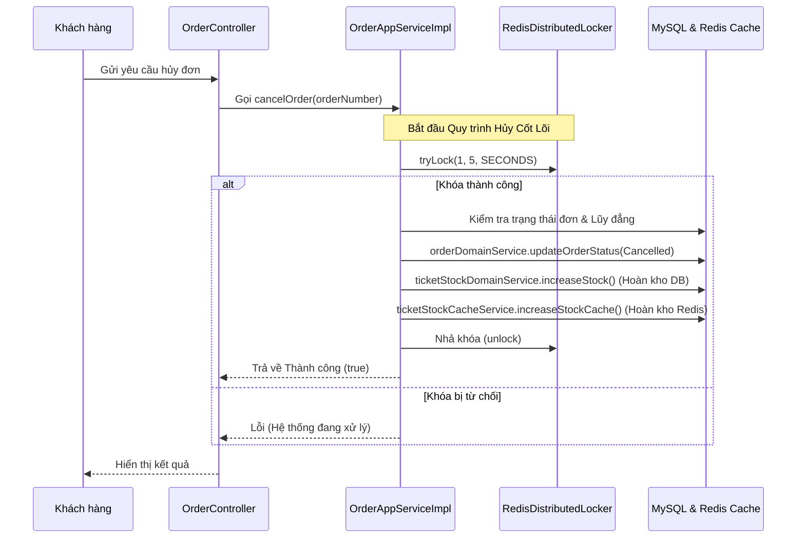

Dưới đây là giải thích chi tiết và toàn diện về hai luồng hủy đơn hàng (Cancellation Flows) trong dự án **Flash Sale Ticket System (Vetautet)**. Hệ thống được thiết kế chặt chẽ để xử lý cả trường hợp người dùng chủ động hủy đơn và hệ thống tự động hủy khi hết hạn thanh toán, đồng thời đảm bảo tính nhất quán của dữ liệu tồn kho thông qua Khóa phân tán (Distributed Lock) và Transaction.

---

## 1. Luồng Hủy Đơn Bất Đồng Bộ Qua MQ (Asynchronous MQ Cancel Flow)

Đây là luồng tự động của hệ thống nhằm thu hồi vé nếu người dùng không thanh toán trong khoảng thời gian cho phép (ví dụ: 1 phút).

### Quy trình hoạt động:

1. **Đăng ký Timeout (Timeout Registration):**
   - Khi một đơn hàng (Pending) được tạo thành công, `OrderAppServiceImpl` hoặc `KafkaOrderConsumer` gọi `orderCancelScheduleService.scheduleTimeout(...)`.
   - Đơn hàng được đẩy vào cấu trúc dữ liệu **ZSET** của Redis với key là `order:cancel`. Điểm (score) của ZSET chính là thời gian hết hạn (thời gian hiện tại + thời gian cho phép thanh toán).

2. **Phát hiện Timeout (Timeout Detection):**
   - Cron job `OrderTimeoutWorker` chạy liên tục mỗi 3 giây (`@Scheduled(fixedDelay = 3000)`).
   - Nó quét Redis ZSET để tìm các đơn hàng có `score` nhỏ hơn hoặc bằng thời gian hiện tại.

3. **Đẩy Message Hủy Đơn (Relaying the Cancel Message):**
   - Thay vì dùng Outbox Pattern như lúc tạo đơn, hệ thống tối ưu tốc độ bằng cách đẩy thẳng thông điệp `CancelOrderMQMessage` vào topic `"order-cancel-topic"` thông qua Kafka Producer.
   - Worker chờ ACK đồng bộ từ Kafka. Nếu Kafka xác nhận thành công, đơn hàng mới được xóa khỏi Redis ZSET. Nếu thất bại, đơn hàng vẫn nằm lại ZSET để retry ở chu kỳ sau.

4. **Safety Net (Cơ chế dự phòng):**
   - Để phòng hờ trường hợp Redis bị sập làm mất dữ liệu ZSET, một cron job khác là `OrderTimeoutSafetyNetJob` sẽ quét database MySQL mỗi 10 phút.
   - Nó tìm các đơn hàng kẹt ở trạng thái `Pending` quá 5 phút và đẩy chúng vào Kafka để xử lý bù.

5. **Tiêu thụ và Xử lý (Consuming & Processing):**
   - `KafkaCancelOrderConsumer` (hoặc `OrderCancelConsumer`) lắng nghe topic `"order-cancel-topic"`. Khi có thông điệp, nó gọi hàm `systemCancelOrder(...)` trong `OrderAppServiceImpl` để tiến hành hủy (chi tiết quy trình này xem ở phần 3).

### Sơ đồ tuần tự (Mermaid Sequence Diagram)

---

## 2. Luồng Hủy Đơn Đồng Bộ (Synchronous Cancel Flow)

Đây là luồng xảy ra khi người dùng chủ động bấm nút "Hủy đơn hàng" trên giao diện. Yêu cầu này được xử lý ngay lập tức (trực tiếp) mà không đi qua Kafka.

### Quy trình hoạt động:
- Frontend gọi API hủy đơn hàng (Ví dụ: `PUT /order/cancel`).
- Controller tiếp nhận và gọi hàm `cancelOrder(userId, orderNumber)` trong `OrderAppServiceImpl`.
- Hàm này thực thi trực tiếp **Quy trình Hủy Cốt Lõi** (chi tiết ở phần 3) và phản hồi kết quả ngay cho người dùng.

### Sơ đồ tuần tự (Mermaid Sequence Diagram)

---

## 3. Cơ Chế Xử Lý Hủy Đơn Cốt Lõi & Hoàn Trả Tồn Kho

Cả hai luồng trên (người dùng gọi `cancelOrder` hoặc hệ thống gọi `systemCancelOrder`) đều hội tụ về một cấu trúc logic gần như giống hệt nhau trong `OrderAppServiceImpl`. Thiết kế này nhằm đảm bảo tính toàn vẹn dữ liệu, chống **Race Condition** (Ví dụ: Người dùng bấm thanh toán đúng vào tích tắc hệ thống đang chạy lệnh hủy timeout).

### Các bước xử lý chi tiết:

1. **Khóa Phân Tán (Distributed Locking bằng Redisson):**
   - Hệ thống gọi `RedisDistributedService` để xin cấp khóa với key `"LOCK:CANCEL_ORDER:" + orderNumber`.
   - Hàm sử dụng `tryLock(1, 5, TimeUnit.SECONDS)`. Nếu không lấy được khóa, chứng tỏ một luồng khác (người dùng đang thanh toán hoặc Worker khác) đang can thiệp vào đơn hàng này. Hàm sẽ lập tức dừng lại (abort) để đảm bảo an toàn.

2. **Kiểm tra Lũy đẳng và Guard State (Idempotency & State Checking):**
   - Lấy thông tin đơn hàng từ DB thông qua shard key (`yearMonth`).
   - **Với `cancelOrder` (Người dùng):** Kiểm tra xem `userId` có khớp không. Nếu đơn hàng đã ở trạng thái hủy (`orderStatus == 2`), hệ thống trả về `true` (Idempotent - gọi nhiều lần vẫn ra một kết quả).
   - **Với `systemCancelOrder` (Hệ thống):** Kiểm tra xem trạng thái có còn là `0` (Pending) không. Nếu đã được thanh toán (1) hoặc đã hủy (2), thông điệp MQ sẽ bị bỏ qua để tránh hủy nhầm đơn đã thanh toán thành công.

3. **Cập nhật trạng thái Database:**
   - Gọi `orderDomainService.updateOrderStatus(..., 2)` để đổi trạng thái đơn hàng thành `Cancelled` trong MySQL.

4. **Phục hồi tồn kho (Stock Compensation & Recovery):**
   - **Dưới Database (MySQL):** Hoàn trả lại số lượng vé đã giữ bằng cách gọi `ticketStockDomainService.increaseStock(ticketId, quantity)`.
   - **Trên Bộ nhớ (Redis Cache):** Hoàn trả lại số lượng vé trên RAM bằng cách gọi `ticketStockCacheService.increaseStockCache(ticketId, quantity)`. Nếu bước cập nhật Redis thất bại, hệ thống chỉ ghi log cảnh báo (để đối soát sau), không làm sập giao dịch chính (vì MySQL là nguồn chân lý cuối cùng).

5. **Đảm bảo bằng Database Transaction:**
   - Toàn bộ quá trình từ bước 2 đến bước 4 được bao bọc bởi `@Transactional(rollbackFor = Exception.class)`.
   - Nếu việc hoàn trả tồn kho MySQL gặp lỗi hệ thống, Exception sẽ được ném ra, toàn bộ trạng thái đơn hàng sẽ được Rollback về `Pending`. Nhờ đó, Kafka Consumer không commit offset và có thể retry lại sau.

6. **Giải phóng khóa (Lock Release):**
   - Khối `finally` được sử dụng để gọi lệnh `lock.unlock()`, đảm bảo khóa Redis luôn được nhả ra dù quá trình hủy thành công hay thất bại. Trang thái khóa được bảo vệ nghiêm ngặt để không xảy ra deadlock hệ thống.