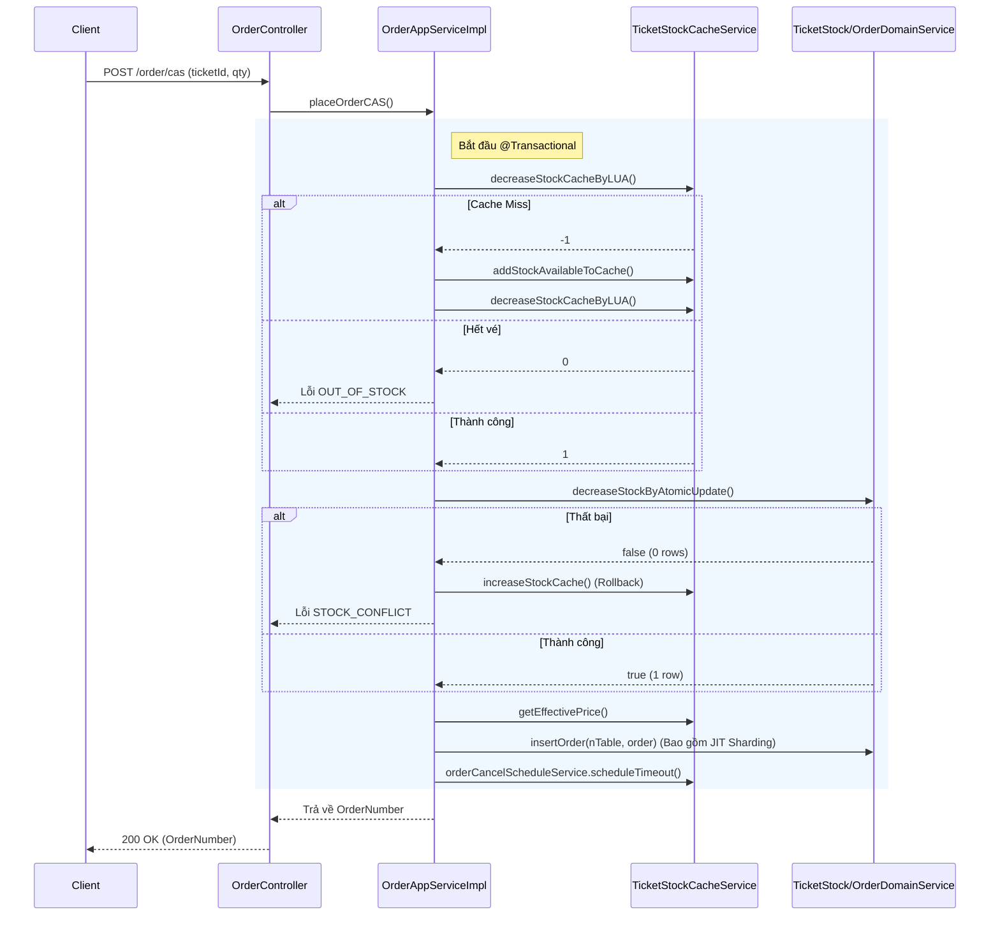
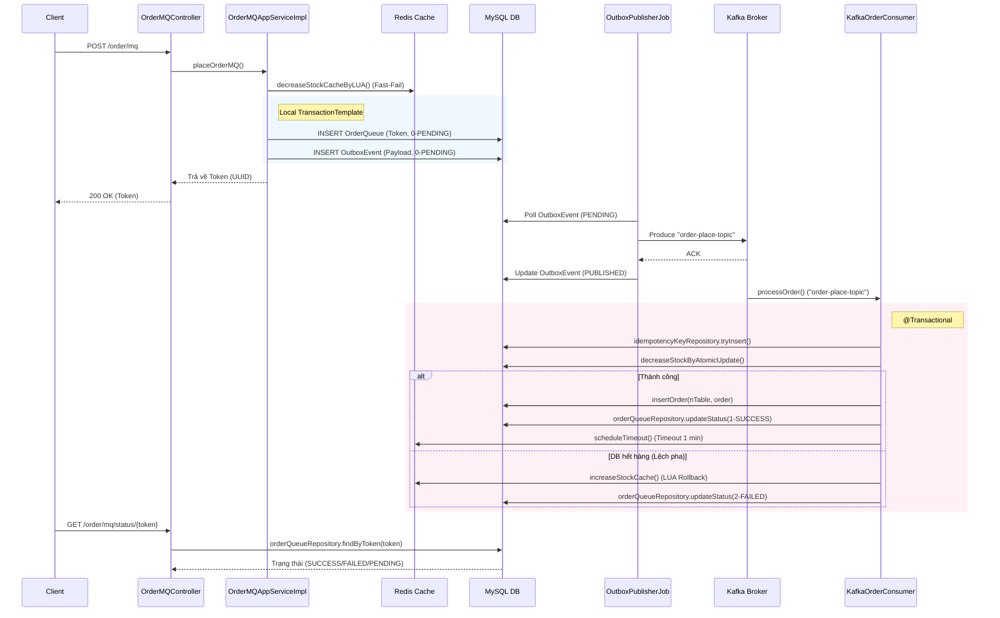

# Phân Tích Kiến Trúc Luồng Đặt Vé Hệ Thống Vetautet

Dự án **Vetautet** là một hệ thống bán vé (ticketing system) được thiết kế theo kiến trúc Domain-Driven Design (DDD) và hỗ trợ xử lý tải cao. Hệ thống cung cấp hai luồng đặt vé riêng biệt để giải quyết bài toán mua vé thông thường và Flash Sale (lượng truy cập đột biến). 

Hai luồng đó là:
1. **Luồng Đồng bộ (Synchronous Flow - CAS)**
2. **Luồng Bất đồng bộ (Asynchronous Flow - MQ / Event-Driven)**

---

## 1. Luồng Đồng bộ (Sync Flow - `POST /order/cas`)

Luồng đồng bộ thực hiện toàn bộ nghiệp vụ từ kiểm tra tồn kho, trừ kho, tính giá đến ghi nhận đơn hàng và lưu vào cơ sở dữ liệu ngay trong quá trình xử lý HTTP request (Synchronous Blocking). Luồng này ứng dụng nguyên tắc **CAS (Compare-And-Swap)** thông qua lệnh cập nhật nguyên tử của DB.

### 1.1. Các thành phần chính (Class) tham gia
- **Controller:** `OrderController`
- **Application Service:** `OrderAppServiceImpl`
- **Cache Service:** `TicketStockCacheService` (xử lý Redis)
- **Domain Service:** `TicketStockDomainService`, `OrderDomainService`
- **Schedule Service:** `OrderCancelScheduleService` (đăng ký hủy đơn)

### 1.2. Chi tiết các bước thực hiện

1. **Tiếp nhận & Xác thực (Controller Layer)**
   - Hàm `placeOrderCAS` trong `OrderController` nhận request `POST /order/cas`.
   - Trích xuất `userId` thông qua `SecurityUtils.getCurrentUserId()`.

2. **Khởi tạo Transaction (Application Layer)**
   - Spring Framework kích hoạt `@Transactional` cho hàm `placeOrderCAS` trong `OrderAppServiceImpl` để đảm bảo ACID.
   - Một cờ (flag) `isRedisDecremented = false` được khởi tạo để rollback thủ công bộ đệm (Cache) nếu có lỗi xảy ra.

3. **Gate-keeping với Redis (Atomic Lua Script)**
   - Gọi `ticketStockCacheService.decreaseStockCacheByLUA()` để trừ kho trực tiếp bằng Lua Script trên Redis. Lua script đảm bảo tính nguyên tử, chặn Race Condition (đua lệnh).
   - **Xử lý tình huống:**
     - `Thành công (Result > 0):` Đặt cờ `isRedisDecremented = true`.
     - `Cache Miss (Result = -1):` Gọi `ticketStockCacheService.addStockAvailableToCache()` (query DB) để làm ấm cache (warm-up), sau đó thử trừ kho lại.
     - `Hết vé (Result = 0):` Return lỗi `OUT_OF_STOCK`. Bức tường này giúp bảo vệ Database không bị quá tải.

4. **Safety Net với MySQL (DB CAS Update)**
   - Gọi `ticketStockDomainService.decreaseStockByAtomicUpdate()` để trừ kho DB với lệnh SQL: `UPDATE ticket SET stock = stock - qty WHERE id = ? AND stock >= qty`.
   - Nếu trả về thất bại (affectedRows = 0, do vé đã bị mua sát nút), ứng dụng sẽ gọi lại `ticketStockCacheService.increaseStockCache()` để hoàn trả vé cho Redis và return lỗi `STOCK_CONFLICT`.

5. **Tính toán giá (Pricing)**
   - Gọi `ticketStockCacheService.getEffectivePrice()` để đọc giá vé, ưu tiên giá Flash Sale nếu có.

6. **Khởi tạo và Lưu Đơn hàng (Dynamic Table Sharding)**
   - Tạo mã đơn bằng `UUID` (tiền tố `OKX-SGN-...`).
   - Gọi `orderDomainService.insertOrder()`. Bên trong lớp này có cơ chế **Double-Check Locking** kết hợp với Redis Lock (`order:create_table:Lock`) để tự động tạo bảng phân mảnh dữ liệu (Data Sharding) theo tháng (VD: `order_202609`) nếu nó chưa tồn tại (JIT Table Creation), sau đó Insert đơn hàng.

7. **Đăng ký Timeout Hủy đơn (Delayed Task qua Redis ZSET)**
   - Gọi `orderCancelScheduleService.scheduleTimeout()` đẩy đơn hàng vào ZSET của Redis (key: `order:cancel`) với score là `hiện_tại + TIMEOUT_MINUTES` (VD: 1 phút).

8. **Hoàn tất (Return)**
   - Nếu chạy êm đẹp, Transaction commit, trả về mã `orderNumber`.
   - Nếu có lỗi Runtime bị `catch`, Redis được trả lại kho bằng `increaseStockCache()`, và Spring tự động Rollback MySQL.

### 1.3. Sơ đồ tuần tự (Sync Flow)

---

## 2. Luồng Bất đồng bộ (MQ Flow - `POST /order/mq`)

Luồng bất đồng bộ (Asynchronous) dùng kiến trúc **Event-Driven** và **Transactional Outbox Pattern** để phân tải cho Flash Sale. Database Write nặng nề được ủy thác cho Kafka Consumer xử lý ngầm (Background), HTTP request chỉ đóng vai trò chốt đơn (Pre-deduct) cực nhanh.

### 2.1. Các thành phần chính (Class) tham gia
- **Controller:** `OrderMQController`
- **Application Service:** `OrderMQAppServiceImpl`
- **Redis Cache:** `TicketStockCacheService`
- **Outbox System:** `OrderQueueRepository`, `OutboxEventRepository`
- **MQ Publisher Worker:** `OutboxPublisherJob`
- **MQ Consumer:** `KafkaOrderConsumer`
- **Repository:** `IdempotencyKeyRepository`

### 2.2. Chi tiết các bước thực hiện

#### Giai đoạn 1: Request & Outbox (Fast-Fail)
1. **Tiếp nhận Request:** `OrderMQController` gọi hàm `placeOrderMQ` và tự tạo một mã `Token` (UUID).
2. **Trừ kho đệm (Fast-Fail Redis):**
   - Giống luồng Sync, `OrderMQAppServiceImpl` gọi `ticketStockCacheService.decreaseStockCacheByLUA()`. Nếu rỗng, từ chối khách hàng ngay mà chưa cần chạm DB.
3. **Transactional Outbox (Local DB):**
   - Ứng dụng dùng `TransactionTemplate` (do gọi nội bộ) để gom 2 lệnh Insert vào cùng 1 transaction:
     - Ghi dòng mới vào `OrderQueue` (trạng thái `0-PENDING`).
     - Ghi payload `PlaceOrderMQMessage` vào bảng `OutboxEvent` (trạng thái `0-PENDING`).
   - Nếu Local Tx lỗi, khối `catch` gọi `ticketStockCacheService.increaseStockCache()` hoàn vé.
4. **Trả kết quả lập tức:** API trả về `token` (Mã số lấy hàng). Client dùng `GET /order/mq/status/{token}` để (Long-polling) theo dõi trạng thái.

#### Giai đoạn 2: Relay Message (Worker)
5. **Outbox Publisher:**
   - Cronjob `OutboxPublisherJob` quét bảng `OutboxEvent` lấy các message `PENDING`.
   - Bắn message vào Kafka topic `"order-place-topic"`. Khi có cờ báo đã bắn (ACK) từ Kafka broker, nó cập nhật dòng ở `OutboxEvent` thành `PUBLISHED`.

#### Giai đoạn 3: Process Order (Kafka Consumer)
6. **Consumer Xử Lý (Hàm `processOrder`):**
   - Lớp `KafkaOrderConsumer` lắng nghe topic `"order-place-topic"`, bọc hàm trong `@Transactional`.
   - **Tính Luỹ Đẳng (Idempotency):** Gọi `idempotencyKeyRepository.tryInsert(token)`. Nếu `INSERT IGNORE` thất bại tức token đã xử lý -> bỏ qua message (Skip).
   - **Trừ kho DB thực tế:** Gọi `ticketStockDomainService.decreaseStockByAtomicUpdate()`.
     - *Thất bại (do lệch pha kho DB vs Redis):* Đánh dấu `OrderQueue` thành `FAILED` và gọi Lua trả lại vé cho Redis.
     - *Thành công:* Gọi `orderDomainService.insertOrder()` (vẫn tạo Sharding table), sau đó cập nhật `OrderQueue` thành `SUCCESS` (kèm sinh ra mã `orderNumber`).
7. **Đăng ký Timeout:**
   - Nếu chốt đơn ok, gọi `orderCancelScheduleService.scheduleTimeout()` vào ZSET để chờ thanh toán (Timeout).

#### Giai đoạn 4: Hủy đơn quá hạn
8. Worker hủy đơn (như `OrderTimeoutWorker`) quét các đơn hết hạn trong ZSET. Nó không hủy thẳng, mà bắn message hủy (VD: `CancelOrderMQMessage`) xuống Kafka topic `"order-cancel-topic"`. (Tách bạch luồng làm việc rủi ro/nặng tải ra khỏi luồng chính).

### 2.3. Sơ đồ tuần tự (MQ Flow)

---

## 3. Bảng So Sánh Kiến Trúc (Sync vs MQ)

| Tiêu chí | Luồng Đồng bộ (Sync) | Luồng Bất đồng bộ (MQ) |
| :--- | :--- | :--- |
| **Mô hình kiến trúc** | Blocking / Request - Response trực tiếp. | Non-blocking / Event-Driven / Outbox Pattern. |
| **Quy trình HTTP** | Client giữ kết nối đợi DB xử lý xong mới nhận kết quả. | Client nhận Token ngay lập tức, ngắt kết nối và gọi API Polling. |
| **Bảo vệ Hệ Thống** | Bị giới hạn ở số lượng luồng (Threads) của Tomcat và Connection Pool (HikariCP). Nếu nghẽn, Request sẽ bị quá hạn (Timeout HTTP). | Sử dụng Kafka như một bộ đệm giảm chấn (Shock Absorber). DB nhận lượng Write ổn định (throttled by consumers). |
| **Sự Phức Tạp (Complexity)** | Đơn giản, Code dễ đọc, dễ debug, đảm bảo Consistency trong 1 Spring Transaction duy nhất. | Rất phức tạp. Đòi hỏi phải rẽ nhánh: xử lý trùng lặp (`IdempotencyKeyRepository`), đảm bảo gửi tin nhắn (`OutboxEvent`), và Eventual Consistency. |
| **Cạnh tranh khóa DB (Lock Contention)**| Nhiều HTTP Threads cùng gọi lệnh `UPDATE` sẽ sinh ra hàng đợi Lock tại tầng Database (Row-level Lock), gây tụt giảm hiệu năng. | `KafkaOrderConsumer` có thể giới hạn Batch/Thread (Ví dụ: `concurrency="10"`), giảm tải đáng kể khóa DB. Việc ghi (Write) diễn ra trật tự hơn. |
| **Trường hợp sử dụng phù hợp** | Các nghiệp vụ mua vé thông thường, rạp chiếu phim (lưu lượng thấp, tính chắc chắn cao). | Săn Sale, Flash Sale, phát hành vé concert nghệ sĩ (lưu lượng đột biến hàng triệu request trong vài giây). |
